# Customer Event Stream (CES) - Architecture Diagram

This document contains the architectural diagram for the Customer Event Stream application, following **Hexagonal Architecture** (Ports & Adapters) and **Domain-Driven Design** principles.

## Architecture Overview

```mermaid
graph TB
    subgraph External["External Systems"]
        Kafka[("Kafka Topics<br/>(Event Stream)")]
        Redis[("Redis<br/>(Session Storage)")]
        WSClient["WebSocket Clients"]
    end

    subgraph Infrastructure["Infrastructure Layer (Adapters)"]
        direction TB
        
        subgraph InputAdapters["Input Adapters"]
            KafkaAdapter["KafkaMessageConsumerAdapter<br/><i>@Component</i>"]
        end
        
        subgraph OutputAdapters["Output Adapters"]
            WSAdapter["WebSocketMessageSender<br/><i>implements MessageSender</i>"]
            RedisRepo["RedisSessionRegistry<br/><i>implements SessionRepository</i>"]
            InMemRepo["InMemorySessionRepository<br/><i>implements SessionRepository</i>"]
        end
        
        subgraph Config["Configuration"]
            AppConfig["ApplicationConfiguration<br/><i>Spring Boot Configuration</i>"]
        end
    end

    subgraph Application["Application Layer (Use Cases)"]
        direction TB
        
        subgraph InputPorts["Input Ports (Driving)"]
            RegPort["RegisterSessionUseCase<br/><i>interface</i>"]
            DelPort["DeliverMessageUseCase<br/><i>interface</i>"]
        end
        
        subgraph Services["Application Services"]
            RegService["RegisterSessionService<br/><i>implements RegisterSessionUseCase</i>"]
            DelService["DeliverMessageService<br/><i>implements DeliverMessageUseCase</i>"]
        end
        
        subgraph OutputPorts["Output Ports (Driven)"]
            MsgSenderPort["MessageSender<br/><i>interface</i>"]
            SessionRepoPort["SessionRepository<br/><i>interface</i>"]
        end
    end

    subgraph Domain["Domain Layer (Core Business Logic)"]
        direction TB
        
        subgraph DomainModel["Domain Model"]
            Session["Session<br/><i>Entity</i><br/>+ connect()<br/>+ disconnect()<br/>+ updateHeartbeat()<br/>+ isExpired()"]
            EventMsg["EventMessage<br/><i>Entity</i><br/>+ getData()"]
            SessionId["SessionId<br/><i>Value Object</i>"]
            SessionStatus["SessionStatus<br/><i>Enum</i><br/>REGISTERED<br/>CONNECTED<br/>DISCONNECTED"]
        end
        
        subgraph DomainServices["Domain Services"]
            SessionRegistry["SessionRegistry<br/><i>interface</i><br/>Session lifecycle mgmt"]
        end
    end

    subgraph Proto["Protobuf Schema"]
        FeedMessage["FeedMessage<br/><i>Generated from OPS-Events-schema</i>"]
    end

    %% External to Infrastructure
    Kafka -->|"Consumes events"| KafkaAdapter
    WSClient <-->|"WebSocket connection"| WSAdapter
    RedisRepo <-->|"Persist/retrieve"| Redis

    %% Infrastructure Input Adapters to Application
    KafkaAdapter -->|"calls deliver()"| DelPort

    %% Application Services implement Input Ports
    RegService -.->|implements| RegPort
    DelService -.->|implements| DelPort

    %% Application Services use Output Ports
    RegService -->|uses| SessionRepoPort
    RegService -->|uses| MsgSenderPort
    DelService -->|uses| SessionRepoPort
    DelService -->|uses| MsgSenderPort

    %% Output Adapters implement Output Ports
    WSAdapter -.->|implements| MsgSenderPort
    RedisRepo -.->|implements| SessionRepoPort
    InMemRepo -.->|implements| SessionRepoPort

    %% Application uses Domain
    RegService -->|"creates/manages"| Session
    DelService -->|"processes"| EventMsg
    
    %% Domain Model relationships
    Session -->|"has"| SessionId
    Session -->|"has"| SessionStatus
    EventMsg -->|"targets"| SessionId
    EventMsg -->|"contains"| FeedMessage
    
    %% Domain Services
    SessionRegistry -->|"manages"| Session

    %% Configuration
    AppConfig -.->|"wires dependencies"| Services

    %% Styling
    classDef domainStyle fill:#e1f5ff,stroke:#01579b,stroke-width:2px
    classDef appStyle fill:#fff9c4,stroke:#f57f17,stroke-width:2px
    classDef infraStyle fill:#f3e5f5,stroke:#4a148c,stroke-width:2px
    classDef externalStyle fill:#ffebee,stroke:#b71c1c,stroke-width:2px
    classDef protoStyle fill:#e8f5e9,stroke:#1b5e20,stroke-width:2px

    class Session,EventMsg,SessionId,SessionStatus,SessionRegistry domainStyle
    class RegPort,DelPort,RegService,DelService,MsgSenderPort,SessionRepoPort appStyle
    class KafkaAdapter,WSAdapter,RedisRepo,InMemRepo,AppConfig infraStyle
    class Kafka,Redis,WSClient externalStyle
    class FeedMessage protoStyle
```

## Architecture Layers

### 1. **Domain Layer** (Core Business Logic)
The innermost layer containing pure business logic with **no framework dependencies**.

#### Domain Model
- **Session** (Entity): Represents a client session with lifecycle management
  - States: REGISTERED → CONNECTED → DISCONNECTED
  - Tracks: sessionId, status, createdAt, lastHeartbeatAt, disconnectedAt
  - Behaviors: connect(), disconnect(), updateHeartbeat(), isExpired()

- **EventMessage** (Entity): Represents messages from Kafka to be delivered to clients
  - Contains: messageId, targetSessionId, FeedMessage (Protobuf), source, timestamp
  - Behavior: getData() for serialization

- **SessionId** (Value Object): Immutable identifier for sessions

- **SessionStatus** (Enum): Defines session lifecycle states

#### Domain Services
- **SessionRegistry** (Interface): Contract for session lifecycle management operations

### 2. **Application Layer** (Use Cases)
Orchestrates business logic using ports and services.

#### Input Ports (Driving Side)
Define **what** the application does:

- **RegisterSessionUseCase**: Contract for registering new client sessions
  - `register(SessionId)` → SessionRegistrationResult

- **DeliverMessageUseCase**: Contract for delivering messages to clients
  - `deliver(EventMessage)` → delivers to specific session
  - `broadcast(EventMessage)` → delivers to all active sessions

#### Application Services
Implement input ports and orchestrate domain logic:

- **RegisterSessionService**: Implements session registration logic
- **DeliverMessageService**: Implements message delivery logic

#### Output Ports (Driven Side)
Define **how** the application interacts with external systems:

- **MessageSender**: Contract for WebSocket communication
  - `sendToSession(SessionId, EventMessage)` → boolean
  - `broadcastToAll(EventMessage)` → void
  - `isConnected(SessionId)` → boolean

- **SessionRepository**: Contract for session persistence
  - `save(Session)` → Session
  - `findById(SessionId)` → Optional<Session>
  - `findAllActive()` → List<Session>
  - `deleteById(SessionId)` → void
  - `existsById(SessionId)` → boolean

### 3. **Infrastructure Layer** (Adapters)
Implements ports and integrates with external systems.

#### Input Adapters (Driving)
Trigger use cases from external events:

- **KafkaMessageConsumerAdapter**: Consumes Kafka events and invokes `DeliverMessageUseCase`

#### Output Adapters (Driven)
Implement output ports:

- **WebSocketMessageSender**: Implements `MessageSender` using Spring WebSocket (STOMP)
- **RedisSessionRegistry**: Implements `SessionRepository` using Spring Data Redis
- **InMemorySessionRepository**: Implements `SessionRepository` using in-memory storage (for dev/testing)

#### Configuration
- **ApplicationConfiguration**: Spring Boot configuration for dependency injection and bean wiring

### 4. **External Systems**
- **Kafka**: Event streaming platform providing customer events
- **Redis**: Session storage for distributed session management
- **WebSocket Clients**: Frontend applications connecting via WebSocket (STOMP over SockJS)

### 5. **Protobuf Integration**
- **FeedMessage**: Generated from `OPS-Events-schema` repository
  - Provides strongly-typed, efficient message serialization
  - Used within EventMessage for payload

## Data Flow

### Session Registration Flow
1. Client initiates session registration (e.g., via REST endpoint - not shown)
2. **RegisterSessionService** (Application) receives request
3. Service creates **Session** domain entity
4. Service persists via **SessionRepository** port (implemented by RedisSessionRegistry)
5. Returns SessionRegistrationResult with WebSocket URL

### Message Delivery Flow
1. **Kafka** publishes customer event
2. **KafkaMessageConsumerAdapter** (Infrastructure) consumes event
3. Adapter deserializes Protobuf **FeedMessage**
4. Adapter creates **EventMessage** domain entity
5. Adapter invokes **DeliverMessageUseCase** (Application)
6. **DeliverMessageService** retrieves target **Session** via **SessionRepository**
7. Service sends message via **MessageSender** port
8. **WebSocketMessageSender** (Infrastructure) delivers to WebSocket client

## Key Design Principles

### Hexagonal Architecture (Ports & Adapters)
- **Ports**: Interfaces defining contracts (input/output ports)
- **Adapters**: Implementations of ports that connect to external systems
- **Core**: Domain and Application layers are independent of infrastructure

### Dependency Rule
- **Domain** depends on: Nothing (pure Java)
- **Application** depends on: Domain only
- **Infrastructure** depends on: Application + Domain + Frameworks

This ensures:
- Business logic is testable without frameworks
- Easy to swap implementations (e.g., InMemory ↔ Redis)
- Clear separation of concerns

### Domain-Driven Design
- **Entities**: Session, EventMessage (with identity)
- **Value Objects**: SessionId (immutable)
- **Domain Services**: SessionRegistry (stateless operations)
- **Ubiquitous Language**: Session lifecycle terminology consistent across all layers

## Testing Strategy

Based on the architecture:

1. **Domain Layer**: Pure unit tests (no mocks needed)
   - Test Session lifecycle transitions
   - Test EventMessage creation and validation

2. **Application Layer**: Unit tests with mocked ports
   - Test RegisterSessionService with mocked SessionRepository
   - Test DeliverMessageService with mocked MessageSender

3. **Infrastructure Layer**: Integration tests
   - Test KafkaMessageConsumerAdapter with embedded Kafka
   - Test RedisSessionRegistry with Testcontainers Redis
   - Test WebSocketMessageSender with WebSocket test client

4. **End-to-End**: Full integration tests
   - Kafka → Application → WebSocket delivery flow

## Technology Stack

- **Java 21+**: Modern Java features
- **Spring Boot 3.x**: Application framework (Infrastructure layer only)
- **Kafka**: Event streaming
- **Redis**: Session storage
- **WebSocket (STOMP)**: Real-time client communication
- **Protobuf**: Message serialization
- **Liquibase**: Database schema migrations
- **JUnit 5**: Testing framework
- **Maven**: Build tool

## Configuration Profiles

- **dev**: Uses InMemorySessionRepository
- **prod**: Uses RedisSessionRegistry with Redis cluster

## Future Enhancements

Potential architectural additions:
1. **REST API Layer**: Add REST controllers for session management
2. **Monitoring**: Add observability ports (metrics, tracing)
3. **Event Sourcing**: Store session events for audit trail
4. **Circuit Breaker**: Add resilience patterns to adapters
5. **API Gateway**: Add external API gateway for client-facing endpoints

---

**Generated**: 2025-10-06  
**Version**: 1.0  
**Architecture Style**: Hexagonal Architecture (Ports & Adapters) + Domain-Driven Design
